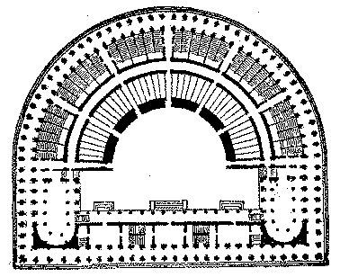
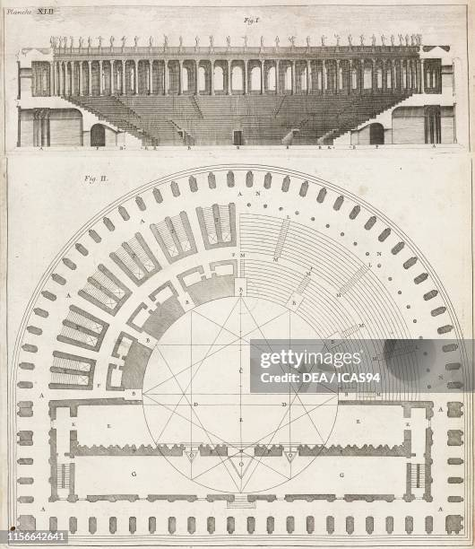

# Arch.Theatre 🏛️🏺🔨
Started 07.20.25 - A new way to document my work.

This project will involve the development of a DD - level theoretical Architecture Project.

This Theatre will be based on several sources, not all formally providing plans or elevations. 

A combination of screen caps I noticed in new Anno game (I have never played a game from that title series, nor is the game I am referencing even formally released, as far as I know.)

[Assest_RefLinks](thub.com/Evergiven-1/Arch.Theatre/tree/main/Assets_RefLinks), will be a rough collection of articles, books and webpages I found that pertain to this development.

